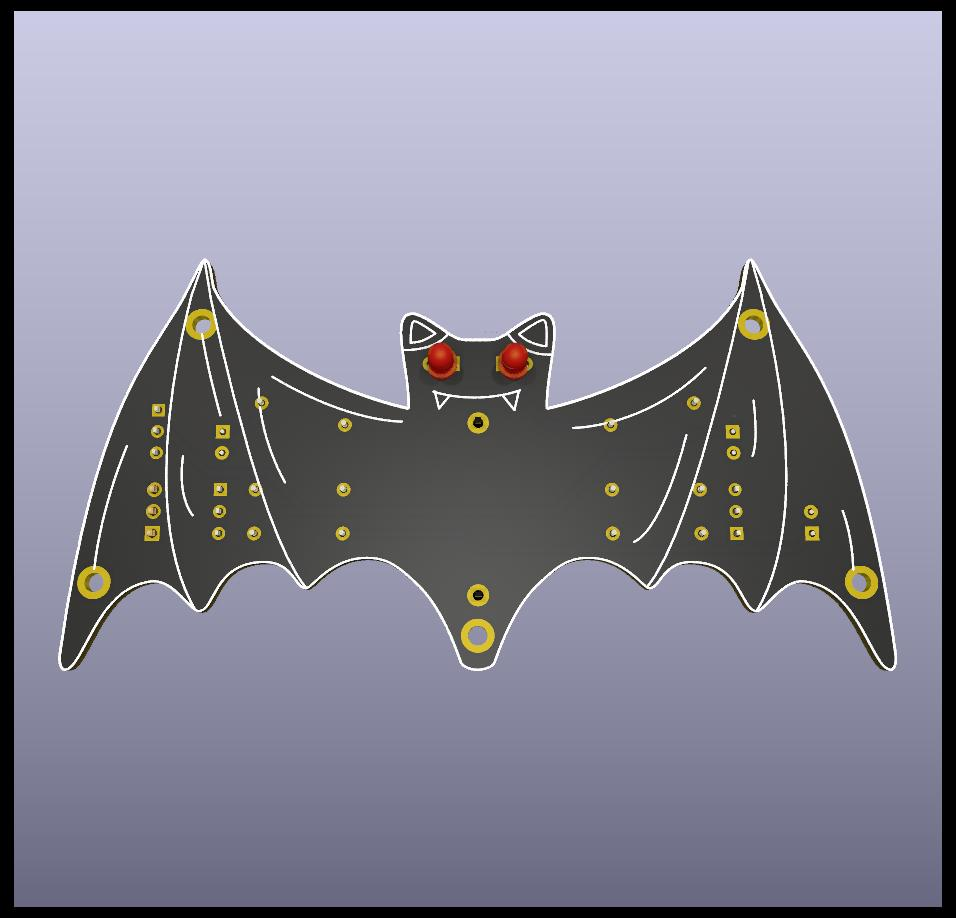
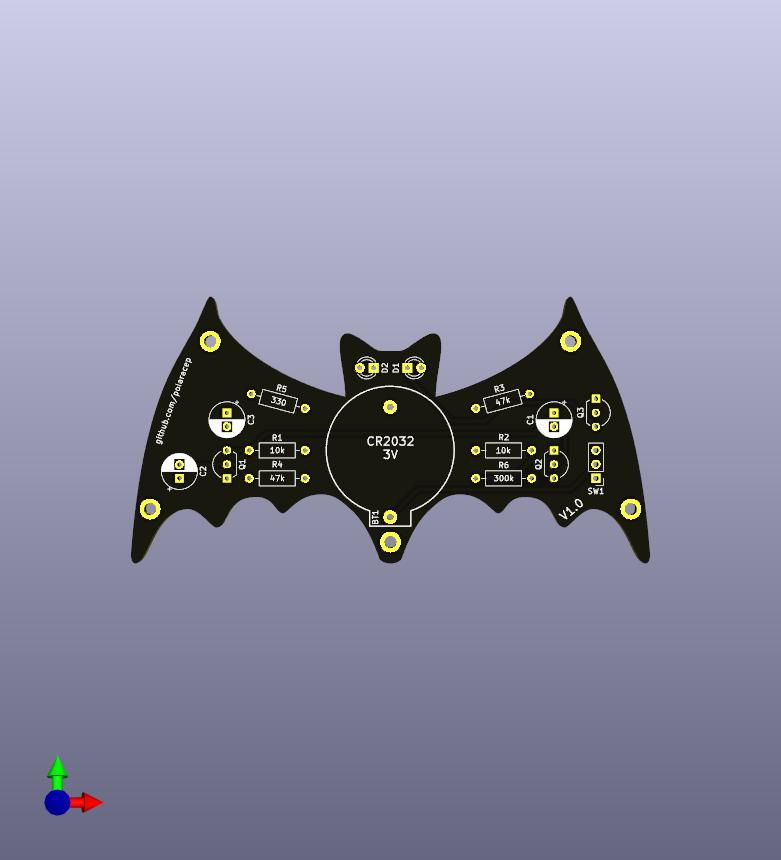
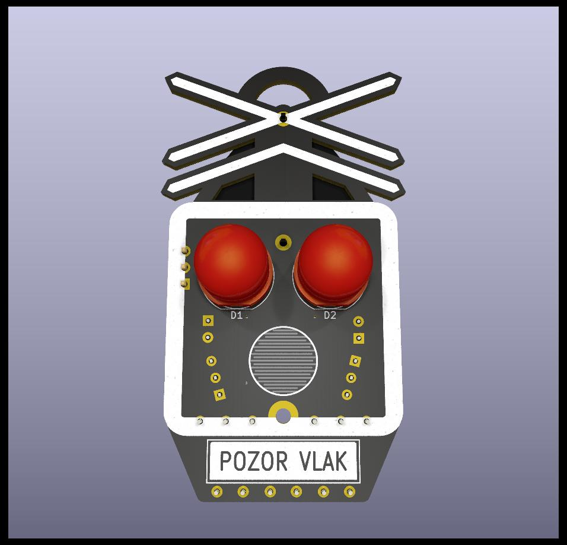
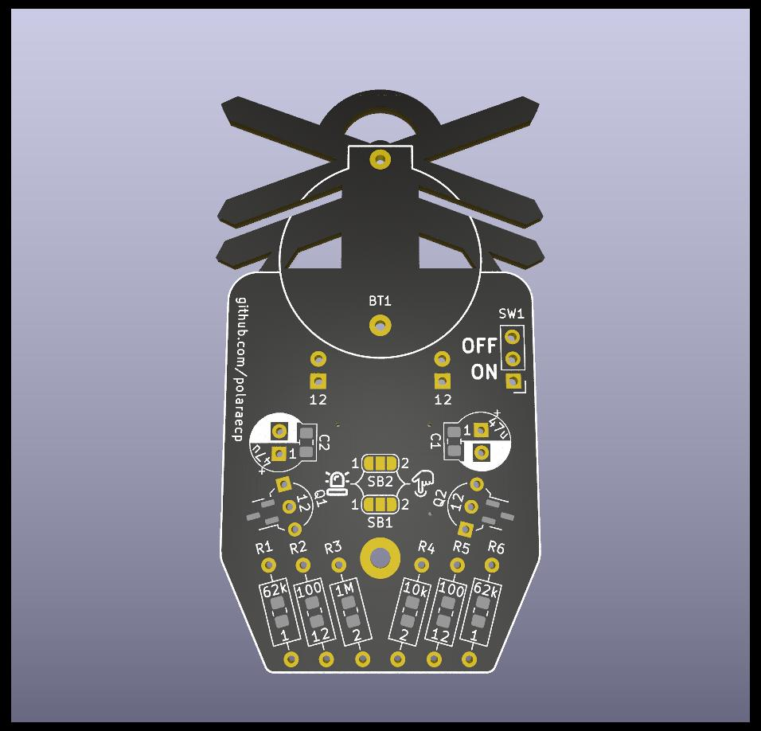

# Soldering kit collection
A collection of cheap soldering kits made with simple analog/TTL circuits. 
The aim is to create inexpensive electronic kits that primarily appeal to childern and get them started on their path of electronic engineering. 
The easiest kits are suitable for childern above the age of 6, but anyone wanting to learn the art of soldering can pick one up.
If you bear some soldering experience already, look at one of the more difficult kits.

All of these kits were made to for [MDDM Úvaly](https://www.mddmuvaly.cz/) and quality-tested by childern. 

Most of the kits are meant to be soldered with THT parts (ease of soldering), but there are also some SMD kits, or kits with both SMD and THT. 
The circuits use a 3V 2032 baterry, due to its small size and low price.

### Ordering
The cheapest PCB manufacturer for such low quantities is definitely [JLCPCB](https://www.jlcpcb.com/). They have a sufficient amount of colour options and the PCBs are good quality. 

For parts I'd recommend LCSC, because of their low prices too.
For cheap parts in bulk: [LCSC](https://www.lcsc.com/).

> [!WARNING]
> This page is work in progress! 

---

### Kit index
- [Bat](#bat)
- [Level crossing](#level-crossing)
- [e-dice](#electronic-dice)
- [Heart badge]
- [MDDM badge]

---

## Bat 

**Difficulty:** :star: :black_circle: :black_circle: 

A Bat with red slowly-blinking eyes. 

    
    

I'm no graphic designer, you're welcome to improve the silkscreen design :)

[See more!](bat/README.md)

 

## Level crossing

**Difficulty:** :star: :black_circle: :black_circle:
A simple multivibrator circuit imitating common czech train crossings. It's really fast & easy to solder thanks to the small count of components needed, just 11!
Circuit uses 2 10mm red LEDs. 2 Selectable modes with a solder bridge: 
- Dynamic blinking :zap:
- Activate the LEDs with a touch-sensitive pad :point_up:

Solderable using SMD or THT parts.

[See more!](/crossing/README.md)

    
    

### Electronic dice

**Difficulty:** :star: :star: :star:

This electronic dice isn't as small as a classic one, but it won't fall off of the table during game nights. Shake to generate a random number.
Uses a SW-420 vibration sensor,

