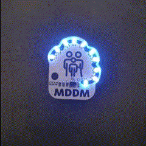

# Soldering kit collection
A collection of cheap soldering kits made with simple analog/TTL circuits. 
The aim is to create inexpensive electronic kits that primarily appeal to childern and get them started on their path of electronic engineering. The easiest kits are suitable for childern above the age of 6, but anyone wanting to learn the art of soldering can pick one up.
If you have some soldering experience already, look at one of the more difficult kits.
All of these kits were made for [MDDM Úvaly](https://www.mddmuvaly.cz/) and quality-tested by childern. 

Most of the kits are meant to be soldered with THT parts (ease of soldering), but there are also some SMD kits, or kits with both SMD and THT. 
The circuits use a 3V 2032 baterry, due to its small size and low price.

### Ordering
The cheapest PCB manufacturer for such low quantities is definitely [JLCPCB](https://www.jlcpcb.com/). They provide good quality PCBs, in my experience, and offer a sufficient range of color options.

For parts in bulk, I'd recommend [LCSC](https://www.lcsc.com/), because of their low prices, but any other vendor will do.

---

### Kit index
- [**Bat**](#bat)
- [**Level crossing**](#level-crossing)
- [**e-dice**](#electronic-dice)
- [**Heart badge**](#heart)
- [**MDDM badge**](#mddm-badge)

---

## Bat 

A Bat with red slowly-blinking eyes

[**See more!**](bat/README.md)

  

I'm no graphic designer, you're welcome to improve the silkscreen design :)

 

## Level crossing

A simple multivibrator circuit imitating common czech train crossings 

2 Selectable modes with a solder bridge: 
- Dynamic blinking :zap:
- Activate the LEDs with a touch-sensitive pad :point_up:

Solderable using SMD or THT parts.

[**See more!**](/crossing/README.md)

  

## Heart

A little SMD heart pin

[**See more!**](/heart-badge/README.md)

  

## MDDM Badge

Programmable LED badge.

[**See more!**](/mddm-badge/README.md)

  

## Electronic dice

A shakeable semi-random dice.

[**See more!**](/e-dice/README.md)
