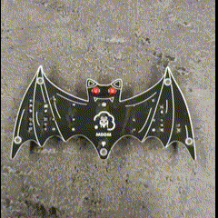
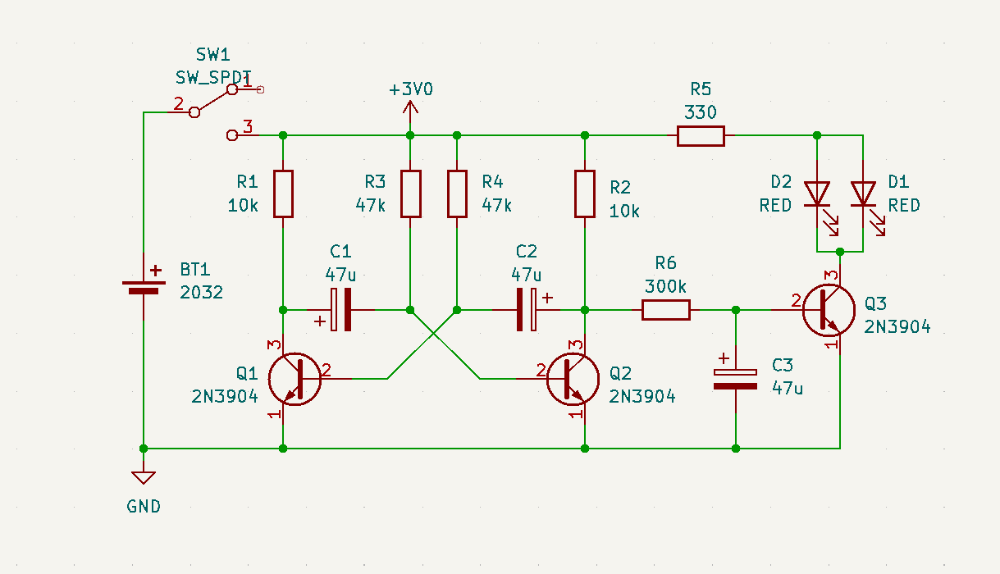

# Bat 

A bat with red glowing eyes

  

### Circuit

The astable multivibrator generates a distorted ramp wave, which in turn gets smoothened out by a filter, driving 2 LEDs with a transistor creating an effect of the bat's ominously blinking eyes.

### Quirks

The circuit can take some time until it starts blinking.

### Schematic

  

### PCB

  

### BOM

| Ref | Value | Package | 
| --- | --- | --- |
| R1, R2 | 10k, 0207 | 110-097
| R3, R4 | 47k, 0207 | 110-113 
| R5 | 330R, 0207 | 110-061
| R6 | 300k, 0207 | 110-132 
| C1, C2, C3 | 47u, 6.3x5 | 123-373 
| Q1, Q2, Q3 | 2N3904, TO92 | 215-003 
| D1, D2 | LED, red 5 mm | R: 518-278, FIAL: 518-519
| BT1 | 2032 Holder | 819-157 

#### Disclaimer 
I hereby give up all responsibility for the functionality of your boards.
