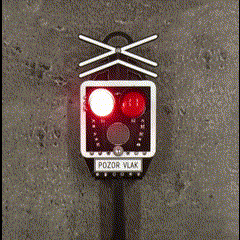
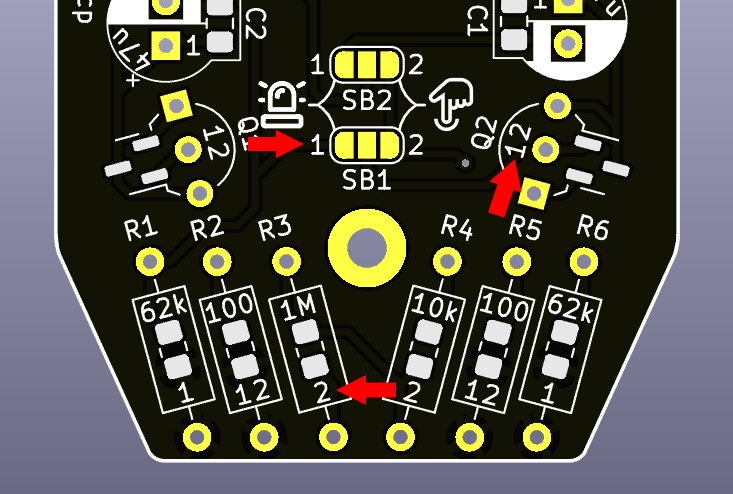
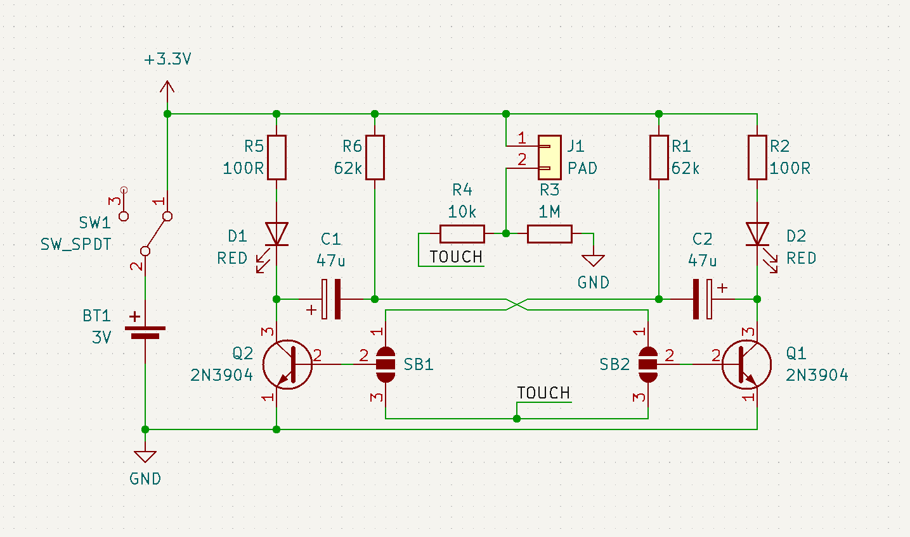
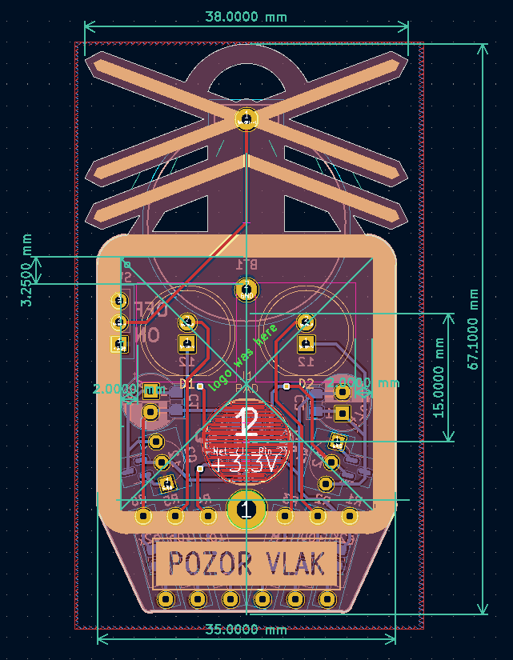

## Level crossing (přejezd)

A level crossing sign. based on czech ažd-97. 

  

### Features 

- 2 selectable operational modes (changeable using solder bridges)
    1) the leds blinking alternately
    2) pad in the middle can be used as a button to turn the leds on
- can be soldered with smd or tht parts.
- a printable leg (M2 screws for mounting)
 
### Mounting

1. On top of the board is a hole for a lanyard/keychain.
2. In the folder `3D addons` are STLs for a leg and hoods for the LEDs. 
    - use an M2 screw
    - No nut is necessary, the leg is made to be a tight fit

### Circuit

[falstad link](https://tinyurl.com/22jwxxro)

the basic circuit is just a basic astable multivibrator with 2 leds. 

the second circuit bypasses the capacitors, instead using a resistive pad and a resistor divider, which pull both bases of the transistors high, thus turning led's on.

you don't need to solder every component for only one of the circuits to work. all parts are labeled with the numbers **1** or **2**, each corresponding to one of the circuits. you can then select the desired one using solder pads.

  

### Schematic

  

### PCB + dimensions

  

### BOM
| REF | CNT | NAME
| --- | ----- | -----
| BT1 | 1 | 2032 Holder
| C1, C2 | 2 | 47uF, 6.3x5
| D1, D2 | 2 | Red LED, 10mm
| Q1, Q2 | 2 | 2N3904, TO-92
| R1, R6 | 2 | 62k, 0207
| R2, R5 | 2 | 100R, 0207
| R3 | 1 | 1M, 0207
| R4 | 1 | 10k, 0207
| SW1 | 1 | 3-Pin, SPDT
| - | - | -
| SUM | 14 | 

#### Disclaimer 
I hereby give up all responsibility for the functionality of your boards. Please purchase only after a review.

