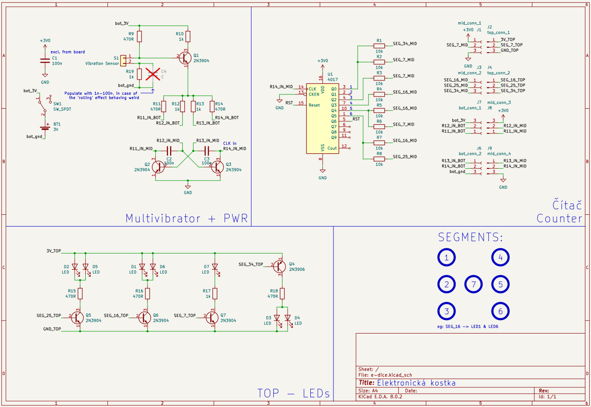
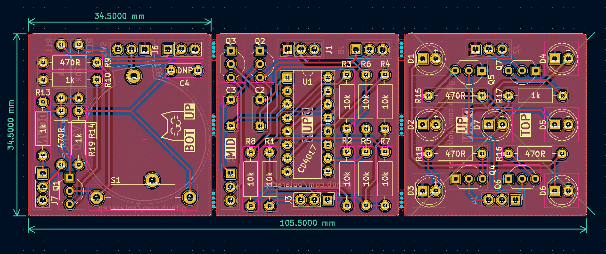

## E-Dice

> [!WARNING]
> This page is not done yet!

  

### Features 

A shakeable dice with semi-random number generator. 

### Mounting

PCB has 3 parts, which have to be mounted on top of one another. I used just male/female sockets, although not testing the durability of such mounting style.
Each part has `UP` and `DOWN` written on them, signalizing the orientation and then one of three position descriptors (`BOT`, `MID`, `TOP`). The assembly follows this diagram:

  

### Circuit

The circuit consists of a fast multivibrator connected to a decade counter, making the rolls seem random.
Triggering mechanism is based on a SW-420 vibration sensor, which supplies power to the multivibrator when shaken and therefore advancing the decade counter rapidly.
A downside to the vibration sensor is certainly its instability, so i'd recommend 3d printing a case for the dice (work in progress), or you can optionally solder another capacitor (C4) to the vibration sensor to dampen it's vibration.

### Schematic

  

### PCB + dimensions

  

### BOM

| REF | CNT | NAME
| --- | ----- | -----
| BT1 | 1 | 2032 Holder
| C2-C3 | 2 | 100n
| C4 | 1 | 1-100n
| D1-D7 | 7 | LED
| J1, J3, J6 J7 | 4 | Mounting header
| J2, J4, J8, J9 | 4 | Mounting socket
| Q1-Q3, Q5-Q7 | 6 | 2N3904
| Q4 | 1 | 2N3906
| R1-R8 | 8 | 10k
| R9, R11, R14-R16, R18 | 6 | 470R
| R10, R12, R13, R17, R19 | 5 | 1k
| S1 | 1 | Vibration Sensor
| SW1 | 1 | SW_SPDT
| U1 | 1 | CD4017
| - | - | -
| SUM | 48 | 

#### Disclaimer 
I hereby give up all responsibility for the functionality of your boards.

