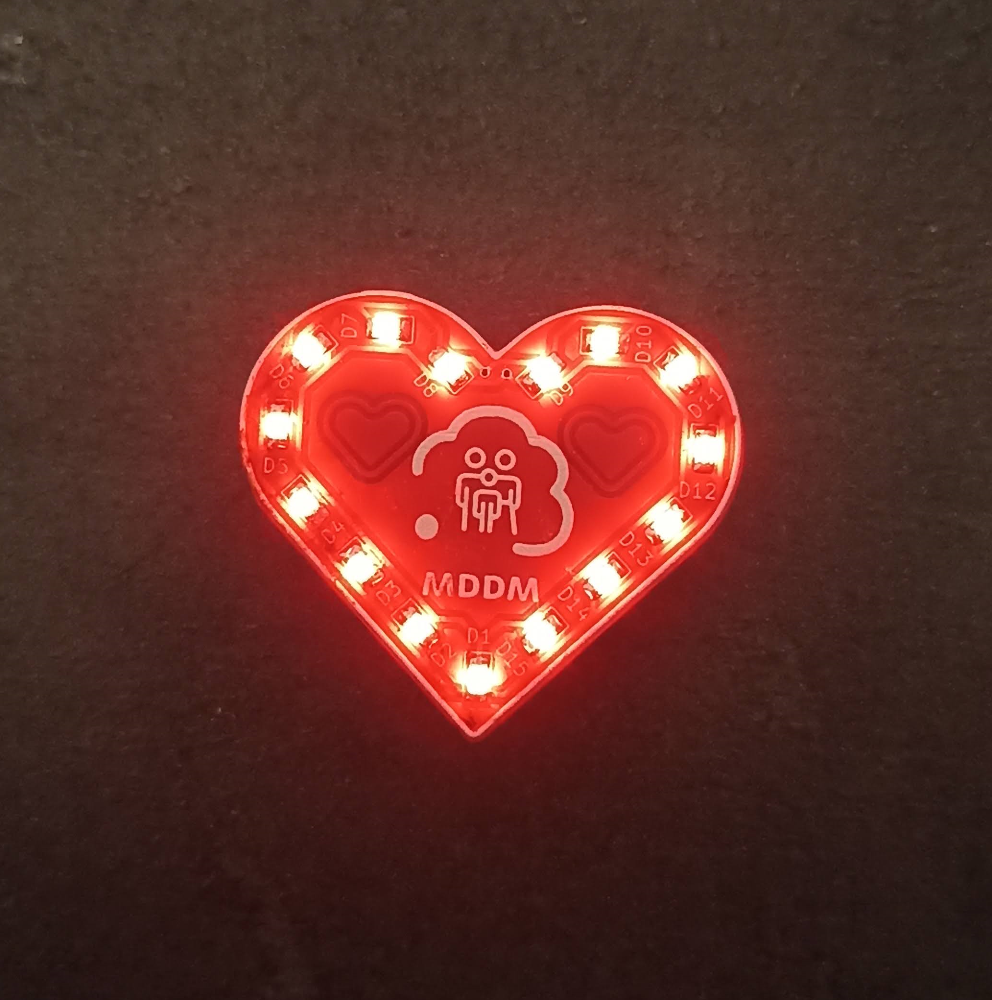
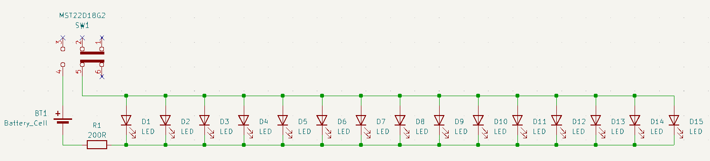
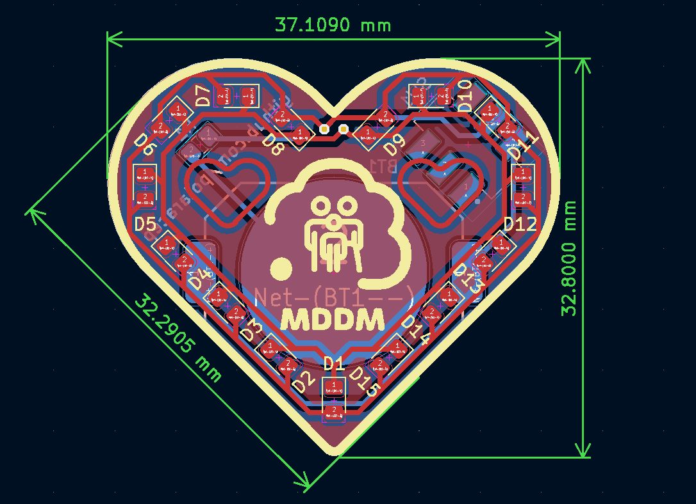

## Heart Badge
A small shining heart badge/pin. Uses 0805 SMD LEDs and resistors. Powered by a 3V 2032 battery.

  

### Mounting
I came up with 2 ways of mounting them:
1. Enamel pins like [these ones](https://www.amazon.com/pins-pin-backs/s?k=pins+and+pin+backs). They won't fall off so easily, but will usually leave a hole in your clothes. I solder them directly on the aluminium battery holder.
2. A neodymium magnet held by superglue to the battery holder. This method does not leave holes, but make sure to use strong magnets.

### Circuit

15 LEDs wired in parallel with a DPDT switch.  
DPDT switch was used because they're pretty easy to solder, unlike common SMD SPST/SPDT switches.
The resistor I chose is 200R, which is not enough to be bright on daylight, but sufficient in a normal rooms. 

### Schematic

  

### PCB + dimensions

  

### BOM
| REF | CNT | NAME
| --- | ----- | -----
| BT1 | 1 | 2032 Holder
| D1-15 | 15 | LED, 0805
| R1 | 1 | 200R, 0805
| SW1 | 1 | DPDT Switch
| - | - | -
| SUM | 18 | 

#### Disclaimer 
I hereby give up all responsibility for the functionality of your boards.

